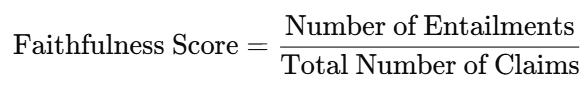

 # metrics란?
 - AI 모델의 성능을 평가하기 위해 사용되는 척도
 - 주로 RAG 파이프라인에서 검색된 컨텍스트, 생성된 답변 등을 평가하여 성능을 측정한다.

 # LLMContextRecall
 > LLMContextRecall(_required_columns: Dict[MetricType, Set[str]] = lambda: {SINGLE_TURN: {'user_input', 'retrieved_contexts', 'reference'}}(), name: str = 'context_recall', llm: Optional[BaseRagasLLM] = None, context_recall_prompt: PydanticPrompt = ContextRecallClassificationPrompt(), max_retries: int = 1, _reproducibility: int = 1)
 - 모델이 반환한 컨텍스트가 정답과 얼마나 관련이 있는지를 평가한다.
 - TP와 FN을 기반으로 관련성을 정량적으로 측정한다.
    - TP: True Positive, 컨텍스트에서 정답에 포함된 관련 정보를 정확히 포함하는 경우
    - FN: False Negative, 컨텍스트에서 정답과 관련된 정보가 누락된 경우
- RAG 시스템의 정보 검색 단계 품질을 측정하는 데 매우 유용하다.

 # FactualCorrectness
 > FactualCorrectness(_required_columns: Dict[MetricType, Set[str]] = lambda: {SINGLE_TURN: {'response', 'reference'}}(), name: str = 'factual_correctness', llm: Optional[BaseRagasLLM] = None, mode: Literal['precision', 'recall', 'f1'] = 'f1', beta: float = 1.0, atomicity: Literal['low', 'high'] = 'low', coverage: Literal['low', 'high'] = 'low', claim_decomposition_prompt: PydanticPrompt = ClaimDecompositionPrompt(), nli_prompt: PydanticPrompt = NLIStatementPrompt(), sentence_segmenter: Optional[HasSegmentMethod] = None, language: str = 'english')
- AI 모델이 생성한 응답이 실제 정답과 얼마나 사실적으로 일치하는지 평가한다.
- Claim Decomposition: 응답에서 주요 문장을 분해하여 각각을 별도로 평가한다.
- 자연어 추론 (NLI): 분해된 각 주장과 참조 텍스트(실제 정답)간의 관계를 평가한다.
    - Entailment: 참조 텍스트가 주장을 뒷받침함.
    - Contradiction: 참조 텍스트가 주장을 반박함.
    - Neutral: 참조 텍스트와 주장의 관계가 불분명함.
- 모델의 생성 단계(답변 생성)의 성능을 측정하는데 유용하다.

# Faithfulness
- 모델이 생성한 응답을 context를 기반으로 얼마나 사실적으로 일관되고 신뢰할 수 있는지 평가하는 데 사용된다.
- 응답의 사실적 일관성을 측정한다. 응답에 포함된 모든 주장이 context에서 유추 가능한지 확인한다. 점수의 범위는 0-1 사이로, 1에 가까울수록 응답이 일관됨을 의미한다.
- 응답에서 사실적인 단위를 추출한 후 (주장 추출), 각 주장을 context와 비교하여 관계를 분류한다 (주장 검증). 주장 검증 단계에서 LLM을 활용한다. 이 과정을 마치면 다음 공식을 통해  Faithfulness socre을 계산한다.
    
- 이 metric은 RAG 파이프라인에서 응답 생성 단계의 품질을 평가하는데 유용하다.